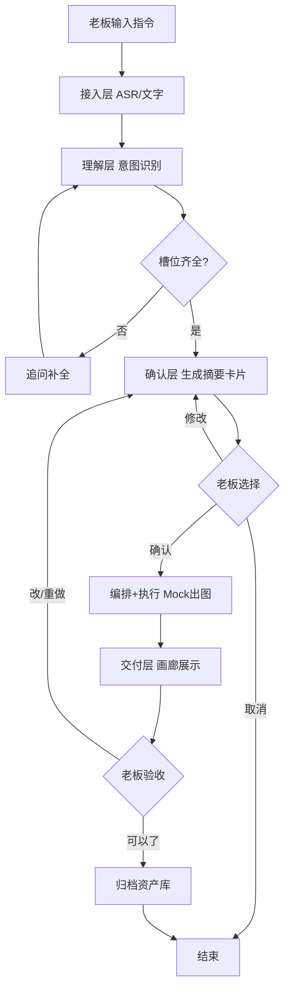

# 老板 AI 助手 网页端 PRD

## 1. 产品概述
为一人电商公司老板提供浏览器端的 AI 助手交互界面，替代现有 CLI。
- 老板通过网页语音/文字吩咐任务（如「给保温杯出 3 张主图」），助手理解后生成任务摘要卡片，老板确认后执行，产出物在画廊中展示并支持验收归档
- 目标：把「吩咐→确认→收图→归档」全链路可视化，让老板像使唤小爱同学一样用网页使唤助手，无需打开终端

## 2. 核心功能

### 2.2 功能模块
1. **对话工作台**（单页）：聊天流 + 任务摘要卡片 + 产出物画廊 + 品牌风格引导，一体化承载全部交互

### 2.3 页面详情
| 页面名称 | 模块名称 | 功能描述 |
|-----------|-------------|---------------------|
| 对话工作台 | 顶部品牌栏 | 助手名称、品牌风格状态指示、会话重置 |
| 对话工作台 | 聊天流 | 老板与助手的多轮对话气泡，支持文字输入与语音输入按钮（Web Speech API）|
| 对话工作台 | 任务摘要卡片 | 确认阶段展示：任务类型/商品/参数/平台/预估耗时/积分/交付方式，高成本显著标注，附带「确认/修改/取消」三按钮 |
| 对话工作台 | 产出物画廊 | 执行完成后展示 Mock 占位图缩略图网格，支持点击放大；附带「可以了/改第N张/重做」验收按钮 |
| 对话工作台 | 品牌风格引导 | 首次进入时引导设定品牌风格关键词（轻奢/暖色调等），设定后显示当前风格徽章 |
| 对话工作台 | 状态时间线 | 左侧或顶部展示当前任务状态流转（理解→确认→执行→交付→验收）|

## 3. 核心流程

老板进入工作台 → （首次）设定品牌风格 → 输入「小帮小帮，给保温杯出 3 张主图，轻奢暖色调」→ 助手回复任务摘要卡片 → 老板点「确认」→ 助手执行（Mock 出图）→ 画廊展示 3 张占位图 → 老板点「可以了」→ 归档到资产库，对话流追加归档确认。

## 4. 用户界面设计

### 4.1 设计风格
- **方向**：深色暖调轻奢风（Dark Warm Luxury）—— 呼应品牌风格库的「轻奢、暖色调、大面积留白」
- **主色**：深炭灰 `#1A1715` 背景 + 琥珀金 `#C9A961` 强调 + 赤陶橙 `#D97757` 次强调
- **辅色**：暖象牙 `#F5EFE6` 文字 + 深褐 `#3D3530` 卡片底
- **按钮**：胶囊形（确认=琥珀金实心、修改=描边、取消=幽灵按钮）
- **字体**：标题用 Cormorant Garamond（优雅衬线）+ 正文用 Noto Sans SC（思源黑体）
- **布局**：单页三栏——左侧状态时间线（窄）+ 中间聊天流（主）+ 右侧画廊/摘要卡片（ contextual）
- **图标**：线性极简风（Lucide），克制使用
- **质感**：微妙纸质纹理叠加 + 卡片柔光阴影 + 关键元素琥珀金描边光晕

### 4.2 页面设计概览
| 页面名称 | 模块名称 | UI 元素 |
|-----------|-----------|-------------|
| 对话工作台 | 顶部品牌栏 | 深褐底+琥珀金Logo文字，右侧品牌风格徽章+重置按钮 |
| 对话工作台 | 左侧状态时间线 | 垂直步骤条，琥珀金高亮当前节点，已完成节点带勾选 |
| 对话工作台 | 中间聊天流 | 老板气泡右对齐暖象牙、助手气泡左对齐深褐+琥珀描边；底部输入框+语音按钮（红色脉冲录音态）|
| 对话工作台 | 摘要卡片 | 右侧浮现，深褐卡片+琥珀金顶边，参数表+成本徽章+三按钮 |
| 对话工作台 | 画廊 | 右侧网格，占位图带琥珀边框+hover放大；下方验收按钮组 |
| 对话工作台 | 品牌引导浮层 | 首次进入模态，关键词标签可点选+自定义输入 |

### 4.3 响应式
桌面优先（老板主要在电脑前用），平板自适应（折叠左栏到顶部），移动端单列堆叠（聊天为主，卡片/画廊抽屉式唤出）。

### 4.4 动效
- 页面加载：标题与时间线 staggered fade-in
- 助手回复：气泡从左滑入+淡入，带 0.3s 延迟
- 摘要卡片：从右侧 spring 弹入
- 画廊图片：交错淡入（stagger 0.1s）
- 确认按钮 hover：琥珀金光晕扩散
- 语音录音：红色圆点脉冲动画
