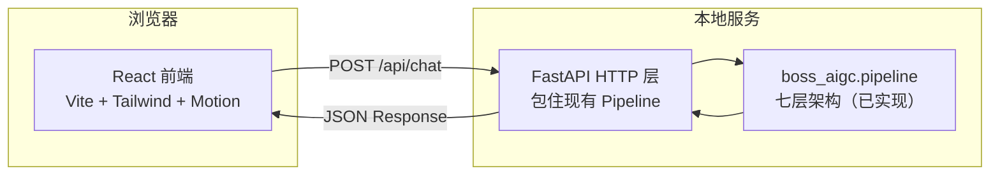

# 老板 AI 助手 网页端 技术架构

## 1. 架构设计



前端通过 fetch 调用本地 FastAPI 服务，FastAPI 复用已实现的 `Pipeline.handle_user_input`，按 `session_id` 维护 `SessionContext`。

## 2. 技术说明
- **前端**：React@18 + tailwindcss@3 + vite + framer-motion（动画）+ lucide-react（图标）
- **初始化工具**：vite-init（`npm create vite@latest web -- --template react-ts`）
- **后端**：FastAPI（Python，包住现有 boss_aigc.pipeline，不引入数据库）
- **会话存储**：内存字典 `dict[session_id, SessionContext]`（demo 级，无需持久化）
- **语音**：浏览器原生 Web Speech API（SpeechRecognition + SpeechSynthesis），无需后端 ASR/TTS

## 3. 路由定义
| 路由 | 用途 |
|-------|---------|
| `/` | 对话工作台（单页，承载全部交互）|

## 4. API 定义

### POST /api/chat
处理一轮老板输入，返回助手反馈。

```typescript
// 请求
interface ChatRequest {
  message: string;        // 老板输入文本（语音在前端识别后传入）
  session_id?: string;    // 首次为空，后端创建并返回
}

// 响应
interface ChatResponse {
  session_id: string;
  status: "pending" | "understanding" | "awaiting_confirmation"
        | "confirmed" | "executing" | "delivered" | "accepted"
        | "cancelled" | "failed";
  message: string;          // 给老板的反馈文本
  speak_text?: string;      // TTS 播报文本（前端用 SpeechSynthesis 朗读）
  follow_up_question?: string;  // 追问文本
  summary?: {               // 任务摘要卡片（status=awaiting_confirmation 时有）
    task_type: string;
    product: string | null;
    params: Record<string, any>;
    platform: string;
    estimated_duration_sec: number;
    estimated_cost: number;
    is_high_cost: boolean;
  } | null;
  artifacts?: {             // 产出物（status=delivered/accepted 时有）
    artifact_id: string;
    kind: "IMAGE" | "VIDEO" | "TEXT";
    url_or_path: string | null;
    thumbnail_path: string | null;
    metadata: Record<string, any>;
  }[] | null;
  timeline: {               // 状态时间线（每轮返回当前已到达节点）
    label: string;
    status: "done" | "active" | "pending";
  }[];
}
```

### POST /api/reset
重置会话。

```typescript
interface ResetRequest { session_id: string; }
interface ResetResponse { session_id: string; }
```

## 5. 前端目录结构
```
web/
├── src/
│   ├── App.tsx              # 主应用，状态机路由
│   ├── api.ts               # fetch 封装
│   ├── types.ts             # ChatRequest/ChatResponse 类型
│   ├── components/
│   │   ├── BrandBar.tsx     # 顶部品牌栏
│   │   ├── Timeline.tsx     # 左侧状态时间线
│   │   ├── ChatStream.tsx   # 中间聊天流
│   │   ├── MessageBubble.tsx# 单条消息气泡
│   │   ├── InputBar.tsx     # 底部输入框+语音按钮
│   │   ├── SummaryCard.tsx  # 任务摘要卡片
│   │   ├── Gallery.tsx      # 产出物画廊
│   │   └── BrandOnboarding.tsx  # 品牌风格引导浮层
│   ├── hooks/
│   │   ├── useChat.ts       # 对话状态管理
│   │   └── useSpeech.ts     # Web Speech API 封装
│   └── index.css           # Tailwind + 全局样式（字体/纹理/变量）
├── index.html
├── tailwind.config.js
└── vite.config.ts
```

## 6. 后端实现要点
在 `boss_aigc/` 下新增 `server.py`：
- FastAPI app，CORS 允许 localhost:5173（vite 默认）
- `POST /api/chat`：取/创建 SessionContext，调 `pipeline.handle_user_input(message, ctx)`，把 Response + context.extras 组装成 ChatResponse
- `POST /api/reset`：清除该 session 的 context
- 启动：`.venv/bin/uvicorn boss_aigc.server:app --reload --port 8000`
- 复用 `boss_aigc._e2e_test.build_full_pipeline` 装配七层处理器

## 7. 数据模型
无数据库。会话上下文 `SessionContext` 已在 `boss_aigc.pipeline` 定义，内存字典管理。

## 8. 启动方式
```bash
# 后端（终端1）
.venv/bin/pip install fastapi uvicorn
.venv/bin/uvicorn boss_aigc.server:app --reload --port 8000

# 前端（终端2）
cd web && npm install && npm run dev
# 打开 http://localhost:5173
```
